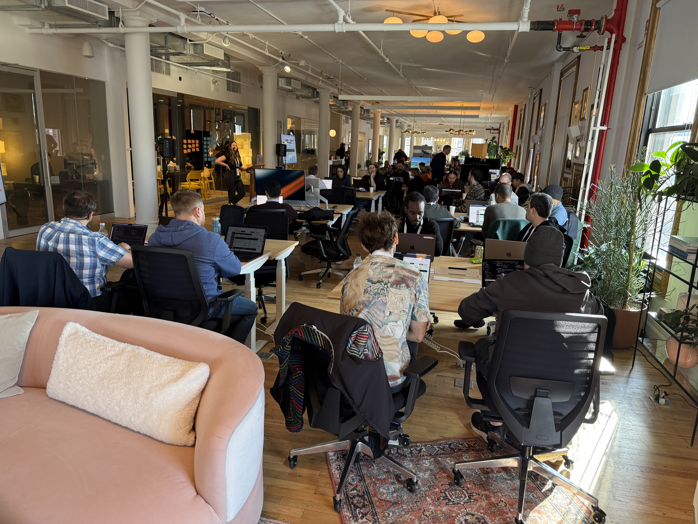
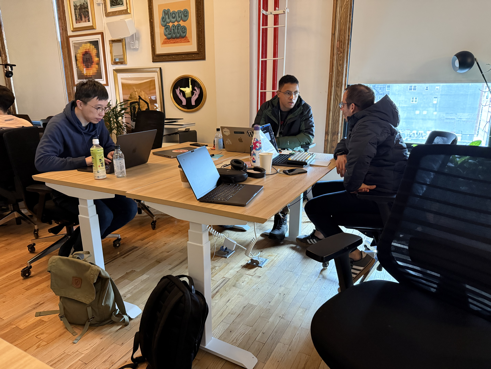

# AI Enablement Workshop
## Our Journey to AI-First

**Noam Almosnino** — Lead Designer, Automattic for Agencies
**Natalia Vidal** — Griffin Team Lead, Day One (Web+Server)

January 2026 | NYC

<!--
Hey everyone, I'm Noam from the A4A design team, and I'm here with Natalia Vidal from Day One. We just spent two weeks at the AI Enablement Workshop in NYC, and we want to share what that experience was like — and what it means for all of us. I'll share my perspective as a designer first, then hand it over to Natalia for the dev perspective.
-->

---

# The Space



**Every day:**
Workshop → Practice time

Space to form new skills into flow.

Conversations at lunch. Late-night chats. Learning together.

<!--
This is the NoHo office where we gathered. Every day had the same rhythm: a workshop session in the morning, then practice time in the afternoon.

That structure gave us space to form new skills into flow — not just learn concepts, but actually practice them.

And honestly, some of the best learning happened outside the sessions. Conversations at lunch, late-night chats at the hotel, random exchanges in the hallway. That's where ideas clicked.
-->

---

# Our Journeys

Most workshops: learn something → go home → maybe apply it → back to routine.

This workshop: learn → **practice** → apply → repeat for two weeks.

**Time to build muscle memory. Not just concepts — habits.**

A designer and a developer. Same experience. Different perspectives.

<!--
Most workshops, you learn something new, go home excited, and then... life happens. You're back to your routine. Maybe you apply one or two things, but most of it fades.

This was different. Two weeks. Every day: learn something in the morning, practice it in the afternoon. Apply it to real work. Repeat. By the end, it wasn't just knowledge — it was muscle memory. Habits.

We want to share our individual journeys — what we came in thinking, what clicked, and what changed. Same experience, but different perspectives: design and dev.
-->

---

# Noam's Journey

**Day 1:** "Am I behind? Am I doing this right?"

**Day 6:** Reaching for AI tools naturally — muscle memory kicking in

> The unknown creates doubt. But we were all learning together.
> That's when I realized: I got this.

<!--
Day one, I walked in with imposter syndrome. You know that feeling — "Am I behind? Is everyone else further along than me?"

But then I started talking to people. At lunch, during breaks, in the hotel lobby. And I realized — we were all in the same place. Everyone was learning. That's when something clicked: I got this.

By day six, I noticed something different. I wasn't thinking about whether to use AI anymore. I was just... reaching for it. Like muscle memory. Commands like /learned to capture insights, /smart-commit for git. It became natural — which is exactly what I hoped for when I wrote my day-one intention.
-->

---

# Noam's Example: Dynamic Copy

**Before:** Generic CTA for all users
```
"Explore Tiers and benefits"
```

**After:** Tier-specific, JTBD-focused labels
```
emerging-partner  → "Start growing"
agency-partner    → "Grow my tier"
pro-agency        → "Unlock more"
premier-partner   → "View my benefits"
```

AI saw the tier data in the code → suggested dynamic copy.
**Context that's hard to get in Figma.**

<!--
Here's a concrete example from the workshop.

I had a card in A4A with a generic call-to-action: "Explore Tiers and benefits." Same button for everyone.

Here's what's interesting: the AI suggested making it dynamic because it could see the tier information was already available in the code. It had context I wouldn't have had in Figma. It knew what data existed and how it could be used.

Through that conversation, I realized we could show different copy based on where the agency is in their journey. "Start growing" for new partners. "Unlock more" for those ready to level up. "View my benefits" for premier partners who've already made it.

The AI helped me think through the jobs-to-be-done framing and write the code. I made a PR — it's in review now. A small example, but it shows how working in the codebase with AI opens up possibilities you wouldn't see in a design tool.
-->

---

# Noam's Example: Claude Code + Day One

**Input** (quick capture):
```
/learned collaboration shifting to source of truth,
prototype in codebase, make PR, not figma handoff
```

**AI refines → Day One**:
> "Collaboration is shifting to the source of truth: prototype in the codebase, make a PR, have engineers refine. Designer and engineer collaborating on the real thing — not Figma-to-handoff."

**Later**: `/learned-review` → synthesized summary of 27 entries

<!--
Here's another example that connects Claude Code with Day One.

I built a slash command in Claude Code called /learned. When I have an insight, I just type it quickly — messy, shorthand, whatever. Claude cleans it up, adds context so it'll make sense months later, and saves it directly to my Day One journal.

So far I've captured 27 learnings from this workshop. And when I need to review them — like when preparing this presentation — I run /learned-review and get a synthesized summary.

It's AI as a capture tool. Quick input, refined output, ready for future me.
-->

---

# Noam's Realization

**Before:** Figma → Handoff → "It doesn't work that way in production"

**Now:** Prototype in the codebase → PR → Iterate together

No more handoff bugs.
**Designer and developer collaborating on the real thing.**

Product + Design + Dev = **Full Stack Designer**

<!--
Here's what really changed for me.

We used to work like this: design in Figma, hand it off, cross our fingers. Then hear back: "It doesn't work that way in production."

Now I can collaborate on the source of truth — the codebase itself. I prototype in real code. I make a PR. Engineers refine it. I iterate on their work with AI. We're both working on the real thing.

I'm not just a designer anymore. With AI, I can pull in product context, understand the codebase, and ship features. Product, design, AND dev. A full-stack individual contributor.

Now let me hand it over to Natalia to share her perspective as a developer.
-->

---

# Natalia's Journey

<!-- NATALIA PLACEHOLDER -->

**[Natalia's day 1 → day 6 experience]**

- What was your mindset coming in?
- What clicked for you?
- What's different now?

<!--
[Natalia's speaker notes here]
-->

---

# Natalia's Example

<!-- NATALIA PLACEHOLDER -->

**[Natalia's concrete example from the workshop]**

- What did you build or ship?
- How did AI help?
- What was the before/after?

<!--
[Natalia's speaker notes here]
-->

---

# Natalia's Realization

<!-- NATALIA PLACEHOLDER -->

**[What's the big shift for you as a dev?]**

- How has your workflow changed?
- What's now possible that wasn't before?
- What does collaboration look like now?

<!--
[Natalia's speaker notes here]
-->

---

# The Possibilities

What excites us most:

- **Parse feedback** from Zendesk, Linear, Slack → then execute
- AI as a **second reaching hand** — commands, skills, context
- The process: **Integrate tools → Build context → Brainstorm → Execute**

Instead of manually checking Slack, run a command — get a summary while you do other things.

<!--
So what are we excited to try going forward?

Full stack workflows. Use AI to parse feedback from Zendesk, Linear, Slack — understand what customers are actually saying. Then execute on that feedback directly.

AI becomes a second reaching hand. We have commands and skills ready to go.

Here's a simple example: instead of manually checking Slack every morning, you can run a command that gathers messages from your channels and gives you a summary with actionables. AI does the gathering while you do other things.

The key insight: it's all about context. Not copy-paste context — integrated context. Tools that read the codebase and build understanding.

The process is: integrate your tools, build context, brainstorm and plan, then execute. Make it subconscious through repetition. That's when AI becomes a natural extension of yourself.
-->

---

# The Investment



> "I'm the most energized I've been in years." — Eric Binnion

Two weeks to learn, practice, and synthesize.

This is a **glimpse of the future** of how we work.

Automattic is getting ahead by being **close and native** to today's tools.

**The question isn't if — it's when.**

<!--
We want to end with something Eric Binnion said during the workshop. He said: "I'm the most energized I've been in years."

And honestly? That was the vibe in the room. This collective sense of possibility.

Getting two weeks to learn, practice, and synthesize with colleagues — through random chats at lunch, late-night conversations in the hotel — is one of the coolest benefits we can get. It's a huge investment in your future self.

We know it's not easy for everyone to do something like this. But if you get the chance — take it.

Because this isn't just about learning new tools. This is a glimpse of the future of how we work. It's a dramatic shift. And Automattic is getting ahead by being close and native to these tools — as James, our Director of AI, put it.

The question isn't if this changes everything. It's when.

Thanks.
-->
